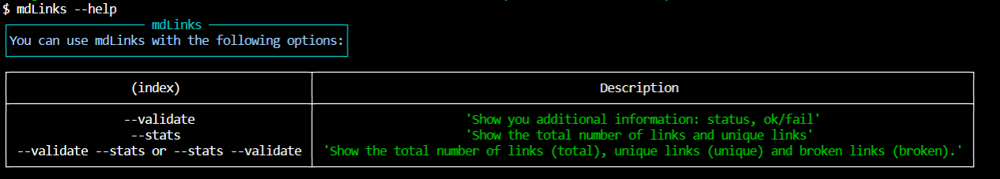

# Markdown Links
It is a library that allows you to validate URLs inside markdown files. It will allow you to obtain: link status, total links, unique links and broken links.

# Getting started
These instructions will allow you to install the library on your local machine for development.

See Deployment for the library developed with Node.js.

Installation 🔧
You can install it by npm:

$ npm i md-links-JaquelineRV

# Guide to use
You can run the library through the terminal:

md-links-checker <path-to-file> [options]
The paths entered can be relative or absolute and the options you can use are: --help, --stats, --validate, or use both together --stats --validate.

Case 1:mdLinks <path-to-file>

Case 2:mdLinks <path-to-file> --validate

Case 3:md-links <path-to-file> --stats

Case 4:mdLinks <path-to-file> --stats --validate or mdLinks <path-to-file> --validate --stats

Case 5:md-links --help

Flowcharts
